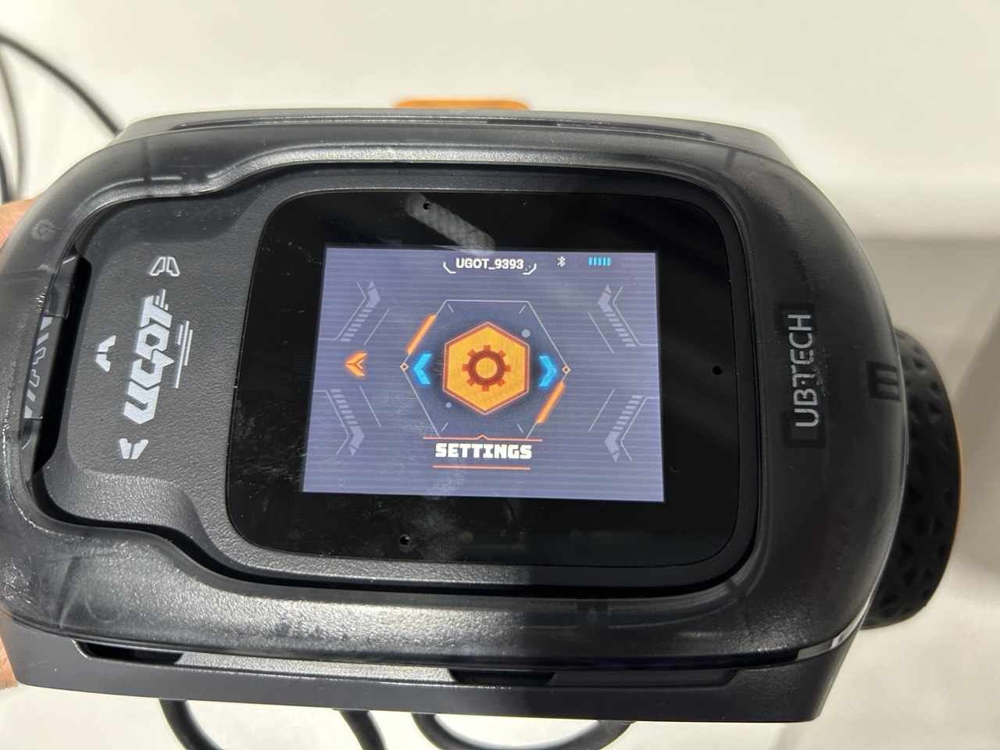
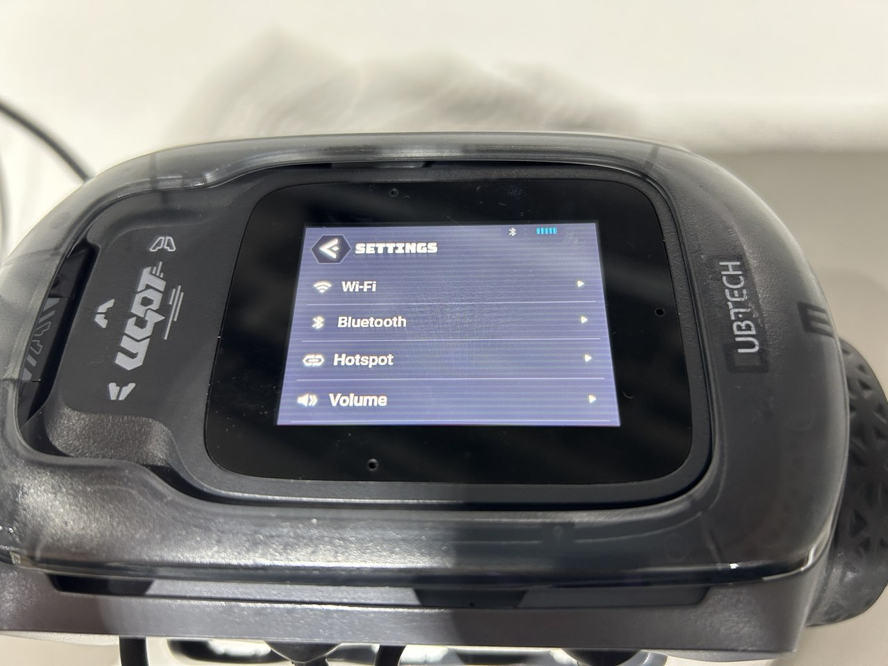
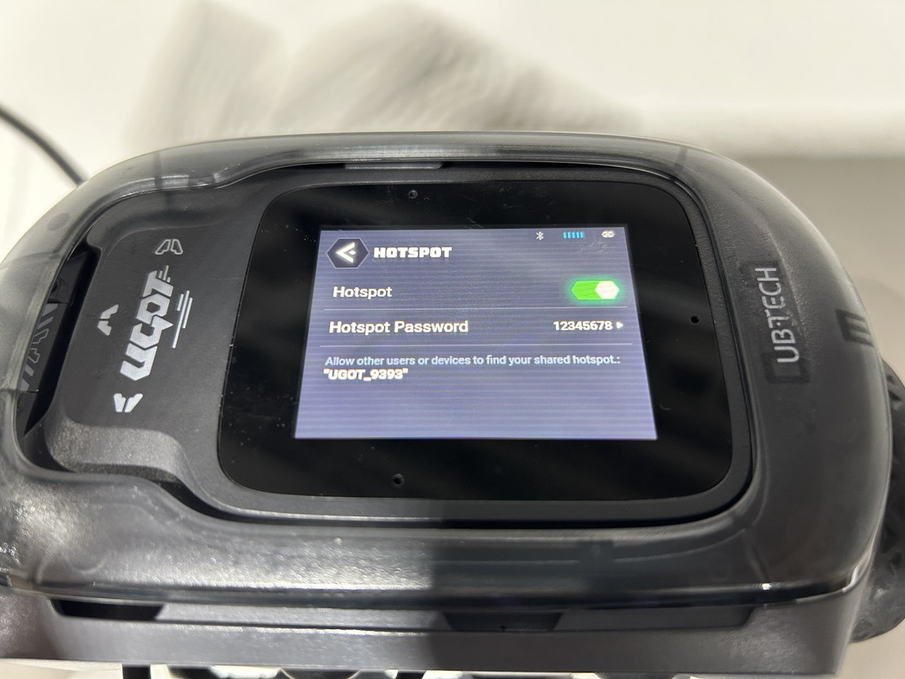
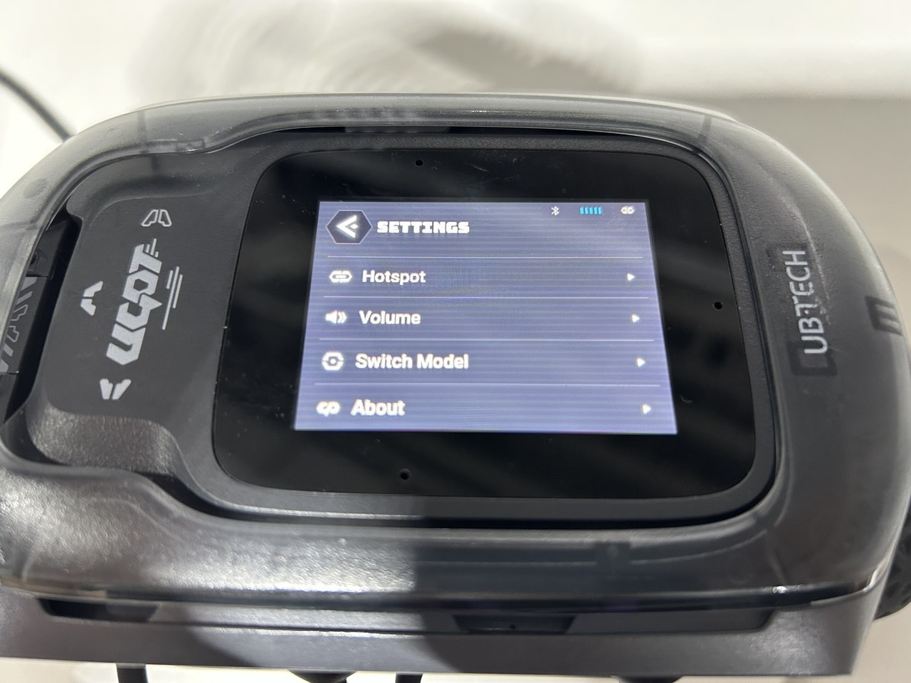
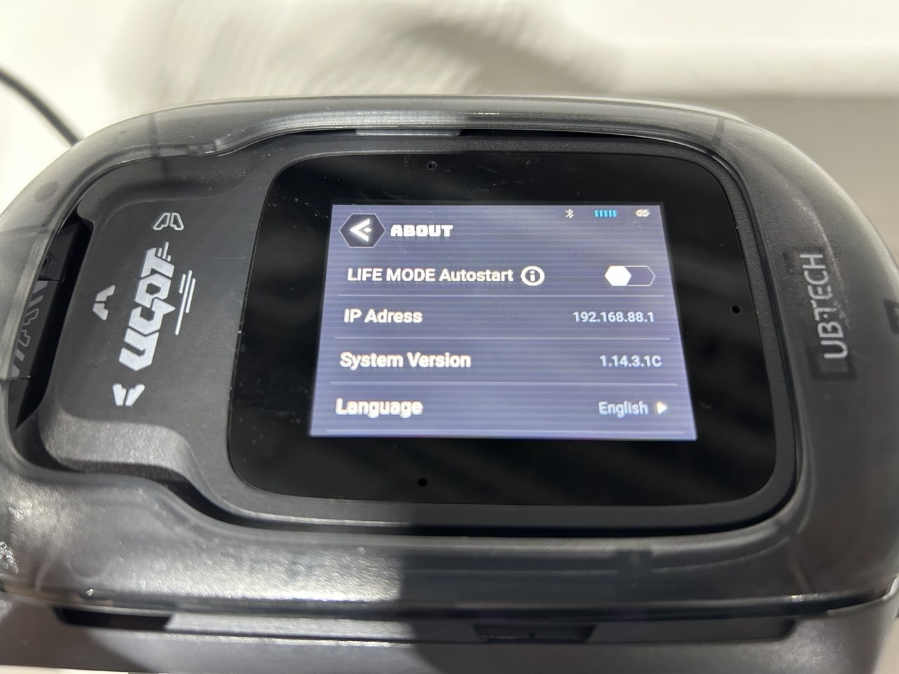
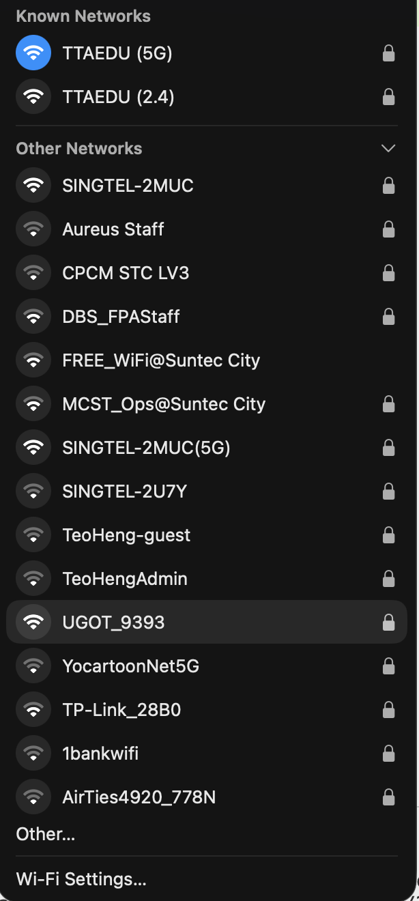

# National Youth Tech Championship 2026

This repository contains the code and setup tutorials used for the **National Youth Tech Championship 2026** robotics challenge.

The project focuses on using **Python and computer vision** to enable your UGOT to perform **image recognition tasks**.

This repository contains some sample files, but more **in depth guides** on OpenCV and UGOT can be found in [Notes](#notes).

---

# Table of contents

1. [Setup Guide](#setup-guide)
2. [How to Download and Install Visual Studio Code (Windows and Mac)](#how-to-download-and-install-visual-studio-code-windows-and-mac)
3. [How to Download and Install Python 3.13 (Windows Only)](#how-to-download-and-install-python-313-windows-only)
4. [Connecting to the UGOT Robot](UGOT_CONNECTION.md)

# Setup Guide

**Note:** You MUST have already downloaded Visual Studio Code [(See below)](#how-to-download-and-install-visual-studio-code-windows-and-mac). Windows computers MUST have also downloaded Python 3.13.12 [(See below)](#how-to-download-and-install-python-313-windows-only).

Download either ["install_WIN.bat"](install_WIN.bat) for Windows computers, or ["install_MAC.sh"](install_MAC.sh) for Mac computers. Once you have downloaded it, double click on the file to run it. There WILL be some warnings, since this script is attempting to install the various packages; please ignore them and run the script.

This will create a folder called "National-Youth-Tech-Championship-2026" on your desktop, with a requirements.txt file and virtual environment (venv) inside. Place all relevant code inside the "National-Youth-Tech-Championship-2026" folder.

Open VS Code, and go to "File" > "Open Folder" > Select your "National-Youth-Tech-Championship-2026" folder to start programming!

## Requirements

To run the code in this repository, you will need:

* Python 3.13.12 (recommended)
* Jupyter Notebook standalone, or
* Visual Studio Code with Jupyter notebook extension (recommended)

# Getting Started

# How to Download and Install Visual Studio Code (Windows and Mac)

Visual Studio Code (VS Code) is a free, lightweight code editor developed by Microsoft. It supports many programming languages and extensions for development.

## 1. Go to the Official Website

1. Open your web browser.
2. Visit the official Visual Studio Code website:

   https://code.visualstudio.com/

## 2. Download Visual Studio Code

1. On the homepage, click the **Download** button.
2. The website usually detects your operating system automatically.


Choose the correct version if needed:

- **Windows** → Download the `.exe` installer
- **macOS** → Download the `.zip` or `.dmg` file

## 3. Install Visual Studio Code

### Windows

1. Open the downloaded `.exe` file.
2. Click **Next** through the installer.
3. Accept the license agreement.
4. (Recommended) Enable:
   - "Add to PATH"
   - "Add 'Open with Code' action"
5. Click **Install**.
6. Click **Finish** when installation is complete.
7. Open it by typing in "Visual Studio Code" in the Windows Search menu.

### macOS

1. Open the downloaded `.zip` file.
2. Drag **Visual Studio Code.app** into the **Applications** folder.
3. Open it from **Applications** or by searching "Visual Studio Code" in Spotlight (CMD + Space)

## 4. Install Necessary Extensions

When VS Code opens, you should see:

- A welcome screen
- A left sidebar with icons (Explorer, Search, Source Control, Extensions)


1. Click on the “Extensions” tab on the side bar. Look for and install the “Python” and “Jupyter” extensions.


# How to Download and Install Python 3.13 (Windows Only)

This guide explains how to download and install **Python 3.13** on **Windows**. Most testing of the various programs has been done specifically on **Python 3.13.12**, which is our recommended version.

Mac users can simply use the ["install_MAC.sh"](install_MAC.sh) file provided.

## Download Python for Windows

## 1. Go to the Official Python Website

Open your browser and visit the official Python website. Python automatically suggests the latest version, but you can download **Python 3.13.12** specifically from:

https://www.python.org/downloads/release/python-31312/

---

## 2. Download Python 3.13

Choose the correct installer for your operating system.

1. Scroll to the **Files** section.

2. You *likely* need to download the 64 bit installation.
Note: if you want to check your architecture, open "Windows Powershell" and enter:

```powershell
$env:PROCESSOR_ARCHITECTURE
```

Possible outputs are :

| Output  | Architecture |
| ------- | ------------ |
| `AMD64` | 64-bit       |
| `x86`   | 32-bit       |
| `ARM64` | ARM          |

If you get something *other* than 64-bit architecture, download the corresponding file.


## 3. Install Python 3.13

Run the installer, which is likely located in your Downloads folder.

‼️**When you run it, be sure to click "Use admin privileges when installing py.exe" and "Add python.exe to PATH".**


Click "Install Now" and wait for the installation to finish. 

## 4. Verify Installation

Open Windows PowerShell and type in:

```powershell
py --version
```

If the installation is complete, the Python version should appear below.

---

# Connecting to the UGOT Robot

This guide walks you through how to connect your laptop to the UGOT robot via its onboard hotspot.

---

## Step 1: Open Settings on the UGOT

On the UGOT's display, navigate to and tap **Settings**.


*The UGOT home screen with the Settings option highlighted.*

---

## Step 2: Enable the Hotspot

Inside Settings, tap **Hotspot** and toggle it **on**.

Make a note of:
- **Hotspot name** — this will be in the format `UGOT_XXXX`
- **Password** — you'll need this to connect your laptop in Step 5



*The Hotspot settings screen showing the network name and password.*

---

## Step 3: Navigate to "About"

Exit the Hotspot screen to return to **Settings**, then scroll down and tap **About**.


*Scrolling down in Settings to find the About section.*

---

## Step 4: Find the UGOT's IP Address

Inside **About**, locate the robot's IP address. This is typically:

```
192.168.88.1
```

Make a note of this — you'll use it to communicate with the robot from your laptop.


*The About screen displaying the UGOT's IP address.*

---

## Step 5: Connect Your Laptop to the UGOT Hotspot

On your laptop, open your Wi-Fi settings and connect to the hotspot you noted in Step 2:

- **Network name:** `UGOT_XXXX`
- **Password:** *(the password from Step 2)*



*Connecting to the UGOT_XXXX network from the laptop's Wi-Fi menu.*

---

## You're Connected!

Once your laptop joins the `UGOT_XXXX` network, you can communicate with the robot using the IP address found in Step 4 (e.g. `192.168.88.1`).

> **Tip:** If you can't connect, double-check that the hotspot is still toggled on and that you're using the correct password.


# Notes

Some scripts may require a connected UGOT robot to function properly.

The links to the relevant documentation of some packages we will use are below:
- [UGOT](https://docs.ubtrobot.com/ugot/#/en-us/extension/python_sdk/version)
- [opencv-python](https://docs.opencv.org/4.x/d6/d00/tutorial_py_root.html)
- [ultralytics](https://docs.ultralytics.com/reference/engine/results/#ultralytics.engine.results.Boxes)
