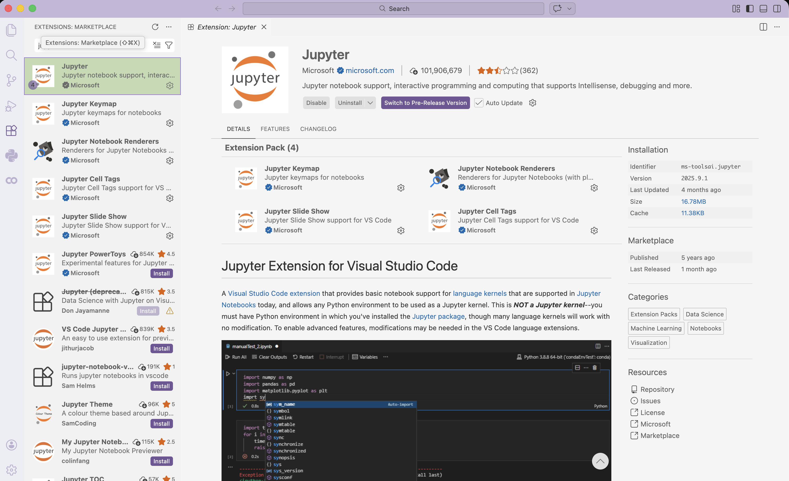
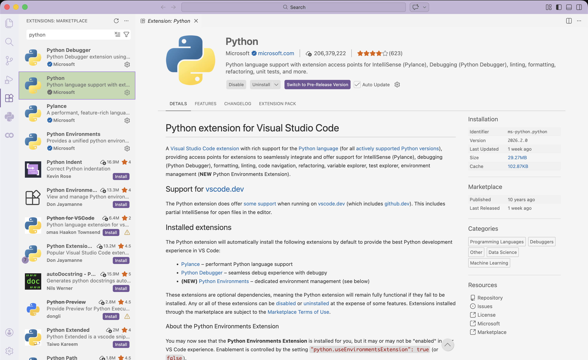
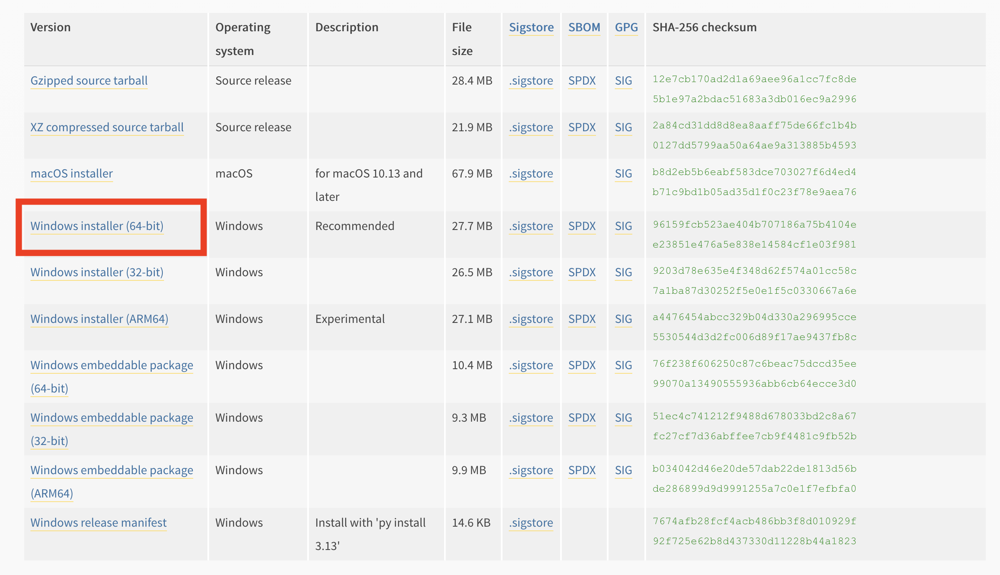

# National Youth Tech Championship 2026

This repository contains the code and setup tutorials used for the **National Youth Tech Championship 2026** robotics challenge.

The project focuses on using **Python and computer vision** to enable your UGOT to perform **image recognition tasks**.

---

# Setup Guide

**Note:** You MUST have already downloaded Visual Studio Code (See 'tutorials/download_vscode.md'). Windows computers MUST have also downloaded Python 3.13.12 (See 'tutorials/download_python.md')

Download either "install_WIN.bat" for Windows computers, or "install_MAC.sh" for Mac computers. Double click on the file to run it. There WILL be some warnings, since this script is attempting to install the various packages; please ignore them and run the script.

This will create a folder called "nytc" on your desktop, with a requirements.txt file and virtual environment (venv) inside. Place all relevant code inside the "nytc" folder.

Open VS Code, and go to "File" > "Open Folder" > Select your "nytc" folder to start programming!

## Requirements

To run the code in this repository, you will need:

* Python 3.13.12 (recommended)
* Jupyter Notebook standalone, or
* Visual Studio Code with Jupyter notebook extension (recommended)

# Getting Started

# How to Download and Install Visual Studio Code (Windows and Mac)

Visual Studio Code (VS Code) is a free, lightweight code editor developed by Microsoft. It supports many programming languages and extensions for development.

## 1. Go to the Official Website

1. Open your web browser.
2. Visit the official Visual Studio Code website:

   https://code.visualstudio.com/

## 2. Download Visual Studio Code

1. On the homepage, click the **Download** button.
2. The website usually detects your operating system automatically.


Choose the correct version if needed:

- **Windows** → Download the `.exe` installer
- **macOS** → Download the `.zip` or `.dmg` file

## 3. Install Visual Studio Code

### Windows

1. Open the downloaded `.exe` file.
2. Click **Next** through the installer.
3. Accept the license agreement.
4. (Recommended) Enable:
   - "Add to PATH"
   - "Add 'Open with Code' action"
5. Click **Install**.
6. Click **Finish** when installation is complete.
7. Open it by typing in "Visual Studio Code" in the Windows Search menu.

### macOS

1. Open the downloaded `.zip` file.
2. Drag **Visual Studio Code.app** into the **Applications** folder.
3. Open it from **Applications** or by searching "Visual Studio Code" in Spotlight (CMD + Space)

## 4. Install Necessary Extensions

When VS Code opens, you should see:

- A welcome screen
- A left sidebar with icons (Explorer, Search, Source Control, Extensions)


1. Click on the “Extensions” tab on the side bar. Look for and install the “Python” and “Jupyter” extensions.






# How to Download and Install Python 3.13 (Windows Only)

This guide explains how to download and install **Python 3.13** on **Windows**. Most testing of the various programs has been done specifically on **Python 3.13.12**, which is our recommended version.

Mac users can simply use the "install_MAC.sh" file provided.

## Download Python for Windows

## 1. Go to the Official Python Website

Open your browser and visit:

https://www.python.org/downloads/

Python automatically suggests the latest version, but you can download **Python 3.13.12** specifically from:

https://www.python.org/downloads/release/python-31312/

---

## 2. Download Python 3.13

Choose the correct installer for your operating system.

1. Scroll to the **Files** section.

2. You *likely* need to download the 64 bit installation.
Note: if you want to check your architecture, open "Windows Powershell" and enter:

```powershell
$env:PROCESSOR_ARCHITECTURE
```

Possible outputs are :

| Output  | Architecture |
| ------- | ------------ |
| `AMD64` | 64-bit       |
| `x86`   | 32-bit       |
| `ARM64` | ARM          |

If you get something *other* than 64-bit architecture, download the corresponding file.




## 3. Install Python 3.13

Run the installer, which is likely located in your Downloads folder.

‼️**When you run it, be sure to click "Use admin privileges when installing py.exe" and "Add python.exe to PATH".**


Click "Install Now" and wait for the installation for finish. 

## 4. Verify Installation

Open Windows PowerShell and type in:

```powershell
py --version
```

If the installation is complete, the Python version should appear below.

---

# Notes

Some scripts may require a connected UGOT robot to function properly.

The links to the relevant documentation of some packages we will use are below:
- [UGOT](https://docs.ubtrobot.com/ugot/#/en-us/extension/python_sdk/version)
- [opencv-python](https://docs.opencv.org/4.x/d6/d00/tutorial_py_root.html)
- [ultralytics](https://docs.ultralytics.com/reference/engine/results/#ultralytics.engine.results.Boxes)
