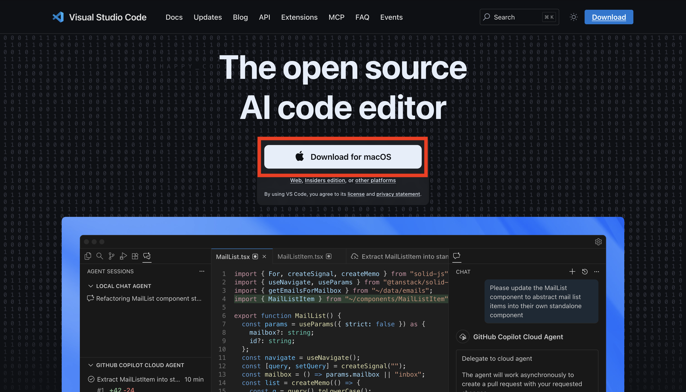
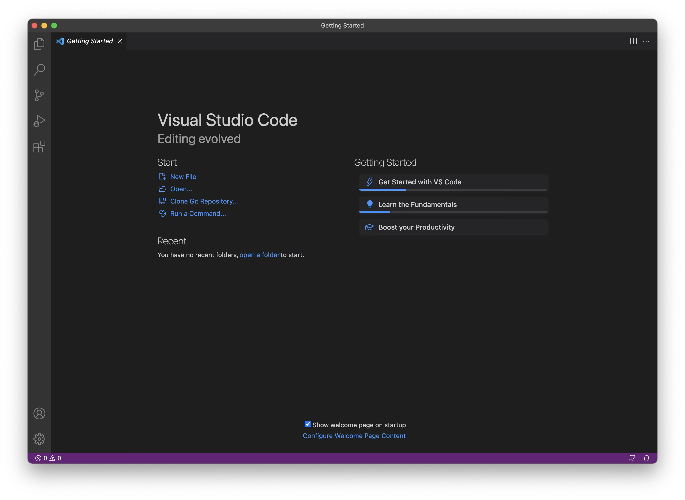
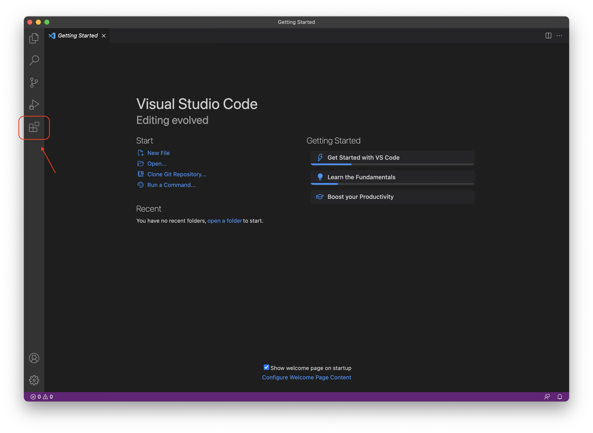

# How to Download and Install Visual Studio Code (Windows and Mac)

Visual Studio Code (VS Code) is a free, lightweight code editor developed by Microsoft. It supports many programming languages and extensions for development.

## 1. Go to the Official Website

1. Open your web browser.
2. Visit the official Visual Studio Code website:

   https://code.visualstudio.com/

## 2. Download Visual Studio Code

1. On the homepage, click the **Download** button.
2. The website usually detects your operating system automatically.

Choose the correct version if needed:

- **Windows** → Download the `.exe` installer
- **macOS** → Download the `.zip` or `.dmg` file

## 3. Install Visual Studio Code

### Windows

1. Open the downloaded `.exe` file.
2. Click **Next** through the installer.
3. Accept the license agreement.
4. (Recommended) Enable:
   - "Add to PATH"
   - "Add 'Open with Code' action"
5. Click **Install**.
6. Click **Finish** when installation is complete.
7. Open it by typing in "Visual Studio Code" in the Windows Search menu.

### macOS

1. Open the downloaded `.zip` file.
2. Drag **Visual Studio Code.app** into the **Applications** folder.
3. Open it from **Applications** or by searching "Visual Studio Code" in Spotlight (CMD + Space)

## 4. Install Necessary Extensions

When VS Code opens, you should see:

- A welcome screen
- A left sidebar with icons (Explorer, Search, Source Control, Extensions)

1. Click on the “Extensions” tab on the side bar. Look for and install the “Python” and “Jupyter” extensions.

