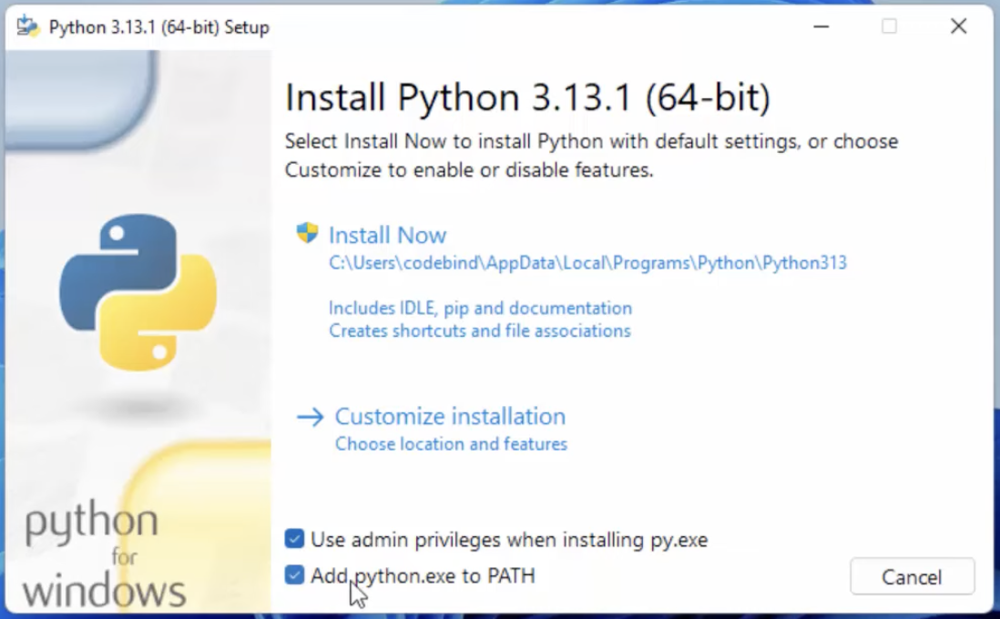

# How to Download and Install Python 3.13 (Windows Only)

This guide explains how to download and install **Python 3.13** on **Windows**. Most testing of the various programs has been done specifically on **Python 3.13.12**, which is our recommended version.

Mac users can simply use the ["install_MAC.sh"](install_MAC.sh) file provided.

## Download Python for Windows

## 1. Go to the Official Python Website

Open your browser and visit the official Python website. Python automatically suggests the latest version, but you can download **Python 3.13.12** specifically from:

https://www.python.org/downloads/release/python-31312/

---

## 2. Download Python 3.13

Choose the correct installer for your operating system.

1. Scroll to the **Files** section.

2. You *likely* need to download the 64 bit installation.
Note: if you want to check your architecture, open "Windows Powershell" and enter:

```powershell
$env:PROCESSOR_ARCHITECTURE
```

Possible outputs are :

| Output  | Architecture |
| ------- | ------------ |
| `AMD64` | 64-bit       |
| `x86`   | 32-bit       |
| `ARM64` | ARM          |

If you get something *other* than 64-bit architecture, download the corresponding file.


## 3. Install Python 3.13

Run the installer, which is likely located in your Downloads folder.

‼️**When you run it, be sure to click "Use admin privileges when installing py.exe" and "Add python.exe to PATH".**



Click "Install Now" and wait for the installation to finish. 

## 4. Verify Installation

Open Windows PowerShell and type in:

```powershell
py --version
```

If the installation is complete, the Python version should appear below.

---